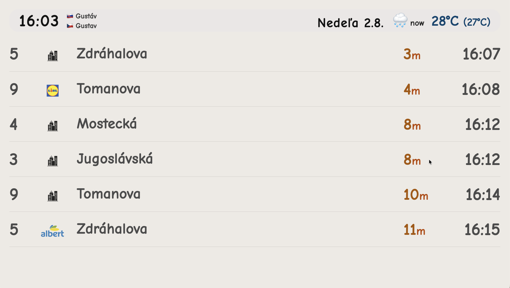

# Brno Tram Display



Real-time departure board for Brno trams — terminal and web. Uses free Czech open data, no API keys required.

**Data sources:**
- **Schedules**: [KORDIS GTFS](https://kordis-jmk.cz/gtfs/gtfs.zip) — re-fetched every 24h, CC BY 4.0
- **Live positions**: [Brno ArcGIS FeatureServer](https://gis.brno.cz/ags1/rest/services/Hosted/ODAE_public_transit_positional_feature_service/FeatureServer/0) — polled every 10s, CC BY 4.0
- **Weather**: [Open-Meteo](https://open-meteo.com/) — temperature, sunrise/sunset for web theme switching

## Quick start

```bash
# Docker (recommended)
docker compose up --build

# Local
npm install && npm start
```

Web interface available at `http://localhost:3000` when running in `web` or `both` mode.

## Display modes

| Mode | How to set | Result |
|------|------------|--------|
| Terminal only | `DISPLAY_MODE=default` (or unset) | ANSI terminal display, no web server |
| Web only | `DISPLAY_MODE=web` | HTTP server at http://localhost:3000 |
| Both | `DISPLAY_MODE=both` | Terminal + web server |

```bash
DISPLAY_MODE=web npm start
```

## Project structure

```
index.js                    # entry point, polling loop
src/
├── adapters/
│   ├── kordis.js           # public API: fetchDepartures, searchStops
│   ├── kordis-gtfs-cache.js    # GTFS zip download, parse, in-memory cache
│   ├── kordis-realtime.js      # live vehicle positions & delay extraction
│   └── openmeteo.js            # weather fetch (temperature, sunrise/sunset)
├── config/
│   ├── constants.js        # URLs, timeouts, magic numbers
│   └── stops.js            # default stop list
├── display/
│   ├── terminal.js         # ANSI terminal rendering
│   ├── web.js              # HTTP server & routing
│   ├── web-data.js         # data assembly and deduplication for web
│   └── web-renderer.js     # HTML/CSS/JS renderer, HTMX polling
└── utils/
    ├── csv.js              # custom CSV parser (handles GTFS quoted fields)
    ├── string.js           # accent-insensitive search normalization
    └── time.js             # Prague timezone, GTFS overflow time handling
res/                        # static logo images served by web display
scripts/
├── rebuild.sh         # production redeploy script
└── setup-runner.sh         # GitHub Actions self-hosted runner setup
```

## Configure stops

Edit `src/config/stops.js` directly:

| Field | Required | Description |
|-------|----------|-------------|
| `stopId` | yes | GTFS `stop_id` from `stops.txt` |
| `name` | yes | Display label |
| `direction` | no | Headsign substring filter (accent/case-insensitive) |
| `lines` | no | Line number whitelist, e.g. `["3","7"]` |
| `minMinutes` | no | Hide departures sooner than N minutes away |
| `logo` | no | Filename from `res/` folder, shown in web display |

## Environment variables

| Variable | Default | Description |
|----------|---------|-------------|
| `DISPLAY_MODE` | `default` | `default` (terminal), `web`, or `both` |
| `PORT` | `3000` | Web server port |
| `POLL_INTERVAL_MS` | `30000` | Data refresh interval (ms) |
| `DEPARTURES_PER_STOP` | `10` | Max departures shown per stop |
| `DEPARTURES_WINDOW_MINUTES` | `90` | How far ahead to look for departures |
| `GTFS_REFRESH_INTERVAL_MS` | `86400000` | GTFS re-download interval (24h) |
| `STOPS` | (from config) | JSON array of stop objects, overrides `stops.js` |
| `DEBUG` | unset | Set to `1` for verbose per-trip logging |


## Deploy

The project ships with a self-hosted GitHub Actions runner that auto-deploys on push to `main`.

Manual redeploy:
```bash
./scripts/rebuild.sh -y            # rebuild and restart
./scripts/rebuild.sh --no-cache -y # force full image rebuild
```

The script stops the container, rebuilds the image, restarts, and cleans up dangling images.

test: commit